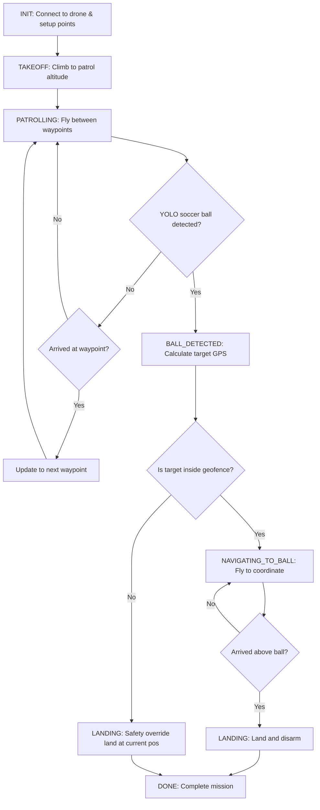

# ArduPilot SITL YOLO Geofence Patroller

An autonomous drone patrol system written in Python using **MAVSDK** and **YOLO (via Ultralytics)**. The script connects to an ArduPilot SITL instance, takes off, patrols an inner loop of waypoints within a software-defined geofence, scans a downward camera feed for a soccer ball (COCO class "sports ball") and humans (COCO class "person"), draws blue bounding boxes over detected humans to verify the object detection system in real time, computes the ball's GPS coordinates, and navigates to it for a precision landing.

---

## Features

- **Programmatic Geofence**: Enforces a coordinate boundary polygon dynamically centered around the drone's home position.
- **Ray-Casting Algorithm**: Validates that all target locations (including the detected ball's coordinate) reside inside the geofence before proceeding, executing a safety landing if a boundary breach is detected.
- **Coordinate Translation Math**: Projects pixel offsets from a downward-pointing (nadir) camera into physical meters, applies yaw rotation to align with the local NED (North-East-Down) frame, and converts the relative offsets to latitude and longitude.
- **State Machine Architecture**: Clean separation of behaviors (`INIT`, `TAKEOFF`, `PATROLLING`, `BALL_DETECTED`, `NAVIGATING_TO_BALL`, `LANDING`, `DONE`).
- **Simulated Mock Mode**: Full offline simulation of flight telemetry, GPS inputs, and camera detections, enabling code dry-runs without any simulator or camera connections.

---

## Architecture & State Machine



---

## Coordinate Translation Math

The projection translates pixel coordinates $(x_{\text{ball}}, y_{\text{ball}})$ from a camera frame of size $W \times H$ to real-world GPS coordinates $(\text{Lat}_{\text{ball}}, \text{Lon}_{\text{ball}})$.

### 1. Ground Footprint Dimensions
Using the drone's current relative altitude $h$, horizontal field of view $\text{HFov}$, and vertical field of view $\text{VFov}$:
$$\text{Width}_{\text{ground}} = 2 \cdot h \cdot \tan\left(\frac{\text{HFov}}{2}\right)$$
$$\text{Height}_{\text{ground}} = 2 \cdot h \cdot \tan\left(\frac{\text{VFov}}{2}\right)$$

### 2. Physical Pixels-to-Meters Scale
$$\text{Scale}_x = \frac{\text{Width}_{\text{ground}}}{W}$$
$$\text{Scale}_y = \frac{\text{Height}_{\text{ground}}}{H}$$

### 3. Pixel Offsets from Center
Given OpenCV coordinate convention (origin at top-left, $x$ increases right, $y$ increases down):
$$x_{\text{offset}} = x_{\text{ball}} - \frac{W}{2}$$
$$y_{\text{offset}} = \frac{H}{2} - y_{\text{ball}}$$

### 4. Body Frame Offsets
- Body X axis (Forward, aligned with image Up/Y-axis): $d_{\text{forward}} = y_{\text{offset}} \cdot \text{Scale}_y$
- Body Y axis (Right, aligned with image Right/X-axis): $d_{\text{right}} = x_{\text{offset}} \cdot \text{Scale}_x$

### 5. Rotation to Local NED Frame
Rotating the body coordinates by the drone's heading angle $\psi$ (yaw, in radians clockwise from North):
$$d_{\text{North}} = d_{\text{forward}} \cos(\psi) - d_{\text{right}} \sin(\psi)$$
$$d_{\text{East}} = d_{\text{forward}} \sin(\psi) + d_{\text{right}} \cos(\psi)$$

### 6. Mapping to Latitude & Longitude
$$\text{Lat}_{\text{ball}} = \text{Lat}_{\text{drone}} + \frac{d_{\text{North}}}{R_{\text{Earth}}} \cdot \frac{180}{\pi}$$
$$\text{Lon}_{\text{ball}} = \text{Lon}_{\text{drone}} + \frac{d_{\text{East}}}{R_{\text{Earth}} \cos\left(\text{Lat}_{\text{drone}} \cdot \frac{\pi}{180}\right)} \cdot \frac{180}{\pi}$$
*(where $R_{\text{Earth}} \approx 6,378,137\text{ m}$)*

---

## Geofence Ray-Casting Algorithm

To guarantee containment, the target is validated against the polygon geofence:
1. A ray is cast horizontally to the right from the target point.
2. We count how many times the ray intersects the polygon edges.
3. If the number of intersections is odd, the target is **inside**; if even, it is **outside**.

---

## Installation

### 1. Create a Python Virtual Environment
To avoid modifying system or Homebrew packages:
```bash
python3 -m venv venv
source venv/bin/activate
```

### 2. Install Dependencies
```bash
pip install --upgrade pip
pip install mavsdk ultralytics opencv-python
```

### 3. Docker Environment Setup (ArduPilot SITL)
For a clean development environment, we use an ARM64-optimized Docker container (`orthuk/ardupilot-sitl-debian`) to run the ArduPilot SITL simulator.

#### Outbound MAVLink Port Routing
Since the simulator runs inside the Docker container, we route MAVLink telemetry out of the container to the host machine using the special domain `host.docker.internal` pointing to port `14550`.

1. **Pull the Docker Image**:
   ```bash
   docker pull orthuk/ardupilot-sitl-debian
   ```
2. **Start the Copter Simulator**:
   Run the container with TTY support in the background (`-dit`), port mappings, and the `--out` forwarding parameter:
   ```bash
   docker run -dit --name ardupilot-sitl \
     --add-host=host.docker.internal:host-gateway \
     -p 14550:14550/udp \
     orthuk/ardupilot-sitl-debian \
     ./Tools/autotest/sim_vehicle.py -v ArduCopter -I0 \
     --custom-location=37.8016,-122.4648,10,0 \
     --out=udp:host.docker.internal:14550
   ```
   - `--add-host=host.docker.internal:host-gateway`: Ensures `host.docker.internal` resolves to your Mac's internal IP address.
   - `--custom-location=37.8016,-122.4648,10,0`: Places the drone's home position at the SF Presidio, matching our coordinate calculations.
   - `--out=udp:host.docker.internal:14550`: Directs the simulator's telemetry output to the host's UDP port `14550`.

---

## Usage

The main script is [patrol_and_detect.py](file:///Users/f1vlad/git/ArduPilotSITL/patrol_and_detect.py).

### Running in Mock Mode
Dry-run the state machine and coordinate math offline without any simulation tools running:
```bash
python3 patrol_and_detect.py --mock
```

### Running with Docker SITL Simulator
1. Ensure the ArduPilot SITL container is running and telemetry outputs are streaming (as described in the Docker Setup section).
2. Run the script on the host machine using one of the provided stadium flight videos.

**Option A: Running with stadium--2.mp4 (start frame 6400)**
```bash
python3 patrol_and_detect.py \
  --address "udpin://127.0.0.1:14550" \
  --video-source "video-samples/stadium--2.mp4" \
  --video-start-frame 6400 \
  --no-video
```

**Option B: Running with stadium--3.mp4 (start frame 2350)**
```bash
python3 patrol_and_detect.py \
  --address "udpin://127.0.0.1:14550" \
  --video-source "video-samples/stadium--3.mp4" \
  --video-start-frame 2350 \
  --no-video
```

### Arguments

| Flag | Default | Description |
|---|---|---|
| `--address` | `udpin://127.0.0.1:14550` | MAVLink/MAVSDK connection port address |
| `--video-source` | `0` | OpenCV Video Source index or URL (e.g. RTSP, stream URL, file path) |
| `--video-start-frame` | `0` | Frame index to start video processing from (only for files) |
| `--mock` | *Disabled* | Runs a simulated flight trajectory and telemetry flow |
| `--no-video` | *Disabled* | Suppresses OpenCV graphical window display (for headless setups) |
| `--altitude` | `10.0` | Target patrol altitude in meters |

---

## Hawthorne-Feather Airpark (8B1) Autonomous Flight

This section describes the parallel workspace setup for manual and autonomous flight testing at **Hawthorne-Feather Airpark (8B1)** (location `43.062722, -71.904925`).

### 1. Docker Setup for Hawthorne-Feather Airpark (8B1)
To start the simulator at the airpark location with dual outputs (port 14550 for QGroundControl and 14540 for Python/MAVSDK scripts):
```bash
docker rm -f ardupilot-sitl && docker run -dit --name ardupilot-sitl \
  --add-host=host.docker.internal:host-gateway \
  orthuk/ardupilot-sitl-debian \
  ./Tools/autotest/sim_vehicle.py -v ArduCopter -I0 \
  --custom-location=43.062722,-71.904925,0,0 \
  --out=udp:host.docker.internal:14550 \
  --out=udp:host.docker.internal:14540
```

### 2. Manual Flight Verification (QGroundControl)
1. Launch **QGroundControl** on your Mac.
2. It will automatically connect to the UDP stream on port `14550`.
3. The satellite view map will show the quadcopter on the runway of Hawthorne-Feather Airpark in New Hampshire.
4. You can use the QGC GUI buttons to Arm, Takeoff, fly guided waypoints, and Land manually.

### 3. Running the Python Script Modes
The [hawthorne_flight.py](file:///Users/f1vlad/git/ArduPilotSITL/hawthorne_flight.py) script supports two execution modes:

#### Option A: QGroundControl Telemetry Monitor Mode
Connects to the simulator and passively prints real-time telemetry updates in your terminal while you command the drone manually from the QGroundControl GUI:
```bash
python3 hawthorne_flight.py --args=qgroundcontrol
```

#### Option B: Programmatic Autonomous Flight Mode
Loads [flight_instructions.yaml](file:///Users/f1vlad/git/ArduPilotSITL/flight_instructions.yaml), validates the starting location, translates the instructions into GPS targets, and flies the route autonomously:
```bash
python3 hawthorne_flight.py --args=programmatic --file=flight_instructions.yaml
```

#### Script Arguments
* `--address`: MAVLink connection port (default: `udpin://127.0.0.1:14540`)
* `--args`: Execution mode choice: `qgroundcontrol` or `programmatic` (default: `programmatic`)
* `--file`: Path to the YAML instruction file (default: `flight_instructions.yaml`, only used in programmatic mode)


